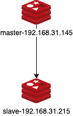

# 配置

redis除了支持多种多样的存储类型，还有一点也非常重要，那就是尽管它是基于内存的存储系统，但它也能进行数据的持久化操作。这一点，对于缓存不幸宕机想恢复缓存数据时相当有效。同样，我们实际使用redis时，为了更高的性能和更高的可用性会将redis配置为集群主从模式。本章节重点介绍持久化和主从复制的相关配置。

## 持久化

redis的持久化有两种方式：**快照持久化（RDB）**和**AOF持久化**。

### 快照持久化（RDB）

快照持久化，是在某一时刻的所有数据写入到硬盘中持久化。显然，这存在一个“何时”写入硬盘的问题。如果相隔时间过长，那么恰好在没有持久化前宕机，这部分数据就会丢失。也就是说，无论如何配置持久化的时机，都有可能存在丢失数据的风险。所以，**快照持久化适用于即使丢失一部分数据也不会造成问题的场景**。

配置快照持久化，既可以直接通过**命令**，也可以通过**配置文件**的方式。

#### 配置文件

回到我们redis的安装位置，根据**第一章准备工作**，redis安装在```/usr/local/redis-5.0.7```路径，修改```redis.conf```配置文件。在配置文件中包含了持久化的相关配置、模板插件、lua脚本等等，我们提取出关于快照持久化相关的配置信息。

```
################################ SNAPSHOTTING  ################################

# save [seconds] [changes] 表示在[seconds]秒内有[changes]个键值的变化则进行持久化。可同时配置多个，满足一个条件则触发。
save 900 1				#在900秒内有1次键值变化则进行持久化。
save 300 10				#在300秒内有10次键值变化则进行持久化。
save 60 10000			#在60秒内有10000次键值变化则进行持久化。

stop-writes-on-bgsave-error yes		#当持久化出现错误时，是否停止数据写入，默认停止数据写入。可配置为no，当持久化出现错误时，仍然能继续写入缓存数据。

rdbcompression yes		#是否压缩数据，默认压缩。可配置为no，不压缩。

rdbchecksum yes				#对持久化rdb文件是否进行校验，默认校验。可配置为no，不校验。

dbfilename dump.rdb		#指定rdb保存到本地的文件名。

dir ./								#指定rdb保存的目录，默认在本目录下，即redis的安装目录。
```

在redis中，持久化默认使用**快照持久化**方式，如果想要开启AOF持久化```appendonly yes```，下文会讲AOF持久化的配置。

**注意，尽管这是redis安装目录下默认的配置文件，但我们在启动时需要制定配置文件的路径。如果在启动时使用```redis-server```则会有以下提示：**

```
10768:C 08 Feb 2020 19:52:40.149 # Warning: no config file specified, using the default config. In order to specify a config file use redis-server /path/to/redis.conf
```

所以我们终止redis服务，并在配置文件中增加一条```save 10 1```“在10秒内有1次键值变化则持久化”配置，指定redis安装目录下的配置文件。

```
okevindeMacBook-Air:redis-5.0.7 okevin$ redis-server redis.conf 
14206:C 11 Feb 2020 23:58:52.589 # oO0OoO0OoO0Oo Redis is starting oO0OoO0OoO0Oo
14206:C 11 Feb 2020 23:58:52.589 # Redis version=5.0.7, bits=64, commit=00000000, modified=0, pid=14206, just started
14206:C 11 Feb 2020 23:58:52.589 # Configuration loaded
```

可以看到，安装目录下的配置文件加载成功。

接下来我们来验证redis是否是“在10秒内有1次键值变化则持久化”，我们通过```redis-cli```进入redis命令行交互，并且写入一条数据。在redis的启动窗口出现了以下日志内容：

```
14234:M 12 Feb 2020 00:02:13.016 * 1 changes in 10 seconds. Saving...
14234:M 12 Feb 2020 00:02:13.017 * Background saving started by pid 14235
14235:C 12 Feb 2020 00:02:13.020 * DB saved on disk
14234:M 12 Feb 2020 00:02:13.121 * Background saving terminated with success
```

这表示配置生效了。

直接修改配置文件的方式需要重启redis服务，我们可以直接通过命令**动态**修改配置：

```
127.0.0.1:6379> config set save "5 1"
OK
```

此时写入一条数据，并在redis的启动窗口验证：

```
14206:M 12 Feb 2020 00:04:26.133 * 1 changes in 5 seconds. Saving...
14206:M 12 Feb 2020 00:04:26.134 * Background saving started by pid 14237
14232:C 12 Feb 2020 00:04:26.139 * DB saved on disk
14206:M 12 Feb 2020 00:04:26.238 * Background saving terminated with success
```

可见，我们已经动态地修改了快照持久化的配置。不过这种动态配置的方式当在redis重启后将会失效。

#### 命令

除了通过配置文件的方式快照持久化，我们还可以通过命令的方式“随时”地进行快照持久化，有两个命令可供使用：```bgsave```和```save```。

```bgsave```，redis会创建一个子进程，通过子进程将快照写入硬盘，父进程则继续处理命令请求。

在redis客户端使用```bgsave```命令：

```
127.0.0.1:6379> bgsave
Background saving started
```

在redis服务端的日志：

```
14234:M 12 Feb 2020 00:15:11.943 * Background saving started by pid 14245
14245:C 12 Feb 2020 00:15:11.948 * DB saved on disk
14234:M 12 Feb 2020 00:15:12.031 * Background saving terminated with success
```

```save```则是redis在快照创建完成前不会响应其他命令，也就是阻塞式的，并不常用。

在redis客户端使用```save```命令：

```
127.0.0.1:6379> save
OK
```

在redis服务端的日志：

```
14234:M 12 Feb 2020 00:16:12.922 * DB saved on disk
```

通过redis服务端的日志我们就能发现，配置文件中的save配置底层调用的是```bgsave```命令。那么什么时候会用到```save```命令呢？

那就是在调用```shutdown```命令时，将会调用```save```命令阻塞其他命令，当执行完成后关闭服务器。

在redis客户端调用```shutdown```命令：

```
127.0.0.1:6379> shutdown
```

在redis服务端的日志：

```
14234:M 12 Feb 2020 00:18:52.353 # User requested shutdown...
14234:M 12 Feb 2020 00:18:52.353 * Saving the final RDB snapshot before exiting.
14234:M 12 Feb 2020 00:18:52.356 * DB saved on disk
14234:M 12 Feb 2020 00:18:52.356 * Removing the pid file.
14234:M 12 Feb 2020 00:18:52.357 # Redis is now ready to exit, bye bye...
```

### AOF持久化

AOF持久化的方式和MySQL中binlog主从同步类似，它记录的是**执行的命令**，将被执行的写命令写入到AOF文件的末尾。它同样有持久化时机的问题，通常我们会配置“每秒执行一次同步”。下面我们仍然通过配置来直观感受一下。

#### 配置文件

```
############################## APPEND ONLY MODE ###############################

appendonly no			#是否开起AOF持久化，默认关闭，yes打开。在redis4.0以前不允许混合使用RDB和AOF，但此后允许使用混合模式，通过最后两个参数配置。

appendfilename "appendonly.aof"			#AOF持久化数据的文件名。

appendfsync everysec		#执行AOF持久化的频率，默认“每秒执行一次同步”。还有“always”选项，表示每个redis命令都要同步写入硬盘，但是这样会严重减低redis的速度。还有“no”选项，此时持久化的时机将有操作系统决定。redis建议如果你不知道怎么做，就使用“everysec”配置。

no-appendfsync-on-rewrite no		#默认不重写AOF文件。

#下面这两个配置是用于AOF“重写”触发条件。当AOF文件的体积大于64m，且AOF文件的体积比上一次重写之后的体积至少打了一倍（100%）则执行重新命令。
auto-aof-rewrite-percentage 100		
auto-aof-rewrite-min-size 64mb	

aof-load-truncated yes			#指redis在恢复时，会忽略最后一条可能存在问题的指令，默认值yes。

aof-use-rdb-preamble yes		#是否打开RDB和AOF混合模式，默认yes打开。
```

我们修改配置文件中```appendonly yes```即打开AOF持久化，并重启redis服务。

和快照持久化略微不同的是我们在```redis-cli```中写入一条数据后，redis服务端并没有记录AOF的持久化日志。但我们在启动时，会出现从AOF文件中加载数据。

```
15336:M 12 Feb 2020 14:21:42.541 # Server initialized
15336:M 12 Feb 2020 14:21:42.542 * DB loaded from append only file: 0.001 seconds
15336:M 12 Feb 2020 14:21:42.542 * Ready to accept connections
```

如果我们此时关闭redis服务端再启动，由于我们开启了持久化所以仍然能获取到刚刚写入的值。

和快照持久化相同，我们同样能在命令行中通过```config set appendonly "yes"```动态修改配置文件。

**在前面的配置文件中，我们提到了“重写”这个术语，它实际上是针对AOF文件过大，需要覆盖掉之前的AOF文件的配置。它和```bgsave```类似，都是通过一个子进程操作。**


## 主从复制

对于一个使用了redis的大型应用程序，为了保证redis的性能，我们会配置redis集群。同MySQL类似，redis的主服务器（master）也会向多个从服务器（slave）发送更新。主服务器负责写、从服务器负责读，以提高性能。

这一小节，我会找到另外一台mac实体机在同一局域网内实现redis主从复制，当然你也可以在虚拟机中试验。



修改master主服务器的配置文件（为了更好演示主从复制，将尽可能做更少的配置）：

```
#bind 127.0.0.1			#默认只允许本机连接redis服务，所以需要注释掉这行配置。
protected-mode no		#默认打开了保护模式，这里我们配置为no关闭。
daemonize no				#实际应用中，我们是通常是将redis以后台运行，也就是会配置为yes，默认是no表示不以后台运行。我们在这里保持默认的配置，方便查看相关的运行日志。
```

修改slave从服务器的配置文件（只比master多一行配置）：

```
#bind 127.0.0.1			#默认只允许本机连接redis服务，所以需要注释掉这行配置。
protected-mode no		#默认打开了保护模式，这里我们配置为no关闭。
daemonize no				#实际应用中，我们是通常是将redis以后台运行，也就是会配置为yes，默认是no表示不以后台运行。我们在这里保持默认的配置，方便查看相关的运行日志。

slaveof 192.168.31.125 6379
```

我们先启动master主服务器显示以下信息：

```
okevindeMacBook-Air:redis-5.0.7 okevin$ redis-server redis.conf 
15702:C 12 Feb 2020 22:18:24.777 # oO0OoO0OoO0Oo Redis is starting oO0OoO0OoO0Oo
15702:C 12 Feb 2020 22:18:24.778 # Redis version=5.0.7, bits=64, commit=00000000, modified=0, pid=15702, just started
15702:C 12 Feb 2020 22:18:24.778 # Configuration loaded
15702:M 12 Feb 2020 22:18:24.781 * Increased maximum number of open files to 10032 (it was originally set to 2560).
                _._                                                  
           _.-``__ ''-._                                             
      _.-``    `.  `_.  ''-._           Redis 5.0.7 (00000000/0) 64 bit
  .-`` .-```.  ```\/    _.,_ ''-._                                   
 (    '      ,       .-`  | `,    )     Running in standalone mode
 |`-._`-...-` __...-.``-._|'` _.-'|     Port: 6379
 |    `-._   `._    /     _.-'    |     PID: 15702
  `-._    `-._  `-./  _.-'    _.-'                                   
 |`-._`-._    `-.__.-'    _.-'_.-'|                                  
 |    `-._`-._        _.-'_.-'    |           http://redis.io        
  `-._    `-._`-.__.-'_.-'    _.-'                                   
 |`-._`-._    `-.__.-'    _.-'_.-'|                                  
 |    `-._`-._        _.-'_.-'    |                                  
  `-._    `-._`-.__.-'_.-'    _.-'                                   
      `-._    `-.__.-'    _.-'                                       
          `-._        _.-'                                           
              `-.__.-'                                               

15702:M 12 Feb 2020 22:18:24.801 # Server initialized
15702:M 12 Feb 2020 22:18:24.803 * DB loaded from append only file: 0.002 seconds
15702:M 12 Feb 2020 22:18:24.803 * Ready to accept connections
```

再启动slave从服务器显示以下信息：

```
t4f-mbp-17346:redis-5.0.7 yulinfeng$ redis-server redis.conf 
13801:C 12 Feb 2020 22:20:08.954 # oO0OoO0OoO0Oo Redis is starting oO0OoO0OoO0Oo
13801:C 12 Feb 2020 22:20:08.954 # Redis version=5.0.7, bits=64, commit=00000000, modified=0, pid=13801, just started
13801:C 12 Feb 2020 22:20:08.954 # Configuration loaded
13801:S 12 Feb 2020 22:20:08.955 * Increased maximum number of open files to 10032 (it was originally set to 256).
                _._                                                  
           _.-``__ ''-._                                             
      _.-``    `.  `_.  ''-._           Redis 5.0.7 (00000000/0) 64 bit
  .-`` .-```.  ```\/    _.,_ ''-._                                   
 (    '      ,       .-`  | `,    )     Running in standalone mode
 |`-._`-...-` __...-.``-._|'` _.-'|     Port: 6379
 |    `-._   `._    /     _.-'    |     PID: 13801
  `-._    `-._  `-./  _.-'    _.-'                                   
 |`-._`-._    `-.__.-'    _.-'_.-'|                                  
 |    `-._`-._        _.-'_.-'    |           http://redis.io        
  `-._    `-._`-.__.-'_.-'    _.-'                                   
 |`-._`-._    `-.__.-'    _.-'_.-'|                                  
 |    `-._`-._        _.-'_.-'    |                                  
  `-._    `-._`-.__.-'_.-'    _.-'                                   
      `-._    `-.__.-'    _.-'                                       
          `-._        _.-'                                           
              `-.__.-'                                               

13801:S 12 Feb 2020 22:20:08.956 # Server initialized
13801:S 12 Feb 2020 22:20:08.956 * Ready to accept connections
13801:S 12 Feb 2020 22:20:08.957 * Connecting to MASTER 192.168.31.145:6379
13801:S 12 Feb 2020 22:20:08.965 * MASTER <-> REPLICA sync started
13801:S 12 Feb 2020 22:20:09.030 * Non blocking connect for SYNC fired the event.
13801:S 12 Feb 2020 22:20:09.034 * Master replied to PING, replication can continue...
13801:S 12 Feb 2020 22:20:09.039 * Partial resynchronization not possible (no cached master)
13801:S 12 Feb 2020 22:20:09.043 * Full resync from master: b7b0b93ea396930cc622250b959fd9eb8eb71c5f:0
13801:S 12 Feb 2020 22:20:09.138 * MASTER <-> REPLICA sync: receiving 185 bytes from master
13801:S 12 Feb 2020 22:20:09.139 * MASTER <-> REPLICA sync: Flushing old data
13801:S 12 Feb 2020 22:20:09.139 * MASTER <-> REPLICA sync: Loading DB in memory
13801:S 12 Feb 2020 22:20:09.139 * MASTER <-> REPLICA sync: Finished with success
```

可以看到从服务器在启动完成后多了一些日志，第一行```MASTER <-> REPLICA sync started```向主服务器发送了同步的命令，一直到最后同步成功。

我们回到master主服务的日志：

```
15702:M 12 Feb 2020 22:20:09.010 * Replica 192.168.31.215:6379 asks for synchronization
15702:M 12 Feb 2020 22:20:09.010 * Full resync requested by replica 192.168.31.215:6379
15702:M 12 Feb 2020 22:20:09.010 * Starting BGSAVE for SYNC with target: disk
15702:M 12 Feb 2020 22:20:09.011 * Background saving started by pid 15703
15703:C 12 Feb 2020 22:20:09.014 * DB saved on disk
15702:M 12 Feb 2020 22:20:09.106 * Background saving terminated with success
15702:M 12 Feb 2020 22:20:09.106 * Synchronization with replica 192.168.31.215:6379 succeeded
```

可以看到，第一行表示有一台从服务器正在请求同步，并且观察日志可以发现主服务器此时执行了```bgsave```命令进行了一次持久化操作。

此时，当我们在主服务写入一条数据时，在从服务器就可以读取到了。但是，如果我们在从服务器写入数据时会出现以下错误：

```
127.0.0.1:6379> set slave master
(error) READONLY You cant't write against a read only replica.
```

**回顾主从复制中的一些细节，除了配置文件需要有注意的地方，在底层当从服务器连接到主服务器时会发送一条```sync```同步命令，当主服务器接收到从服务器的```sync```同步命令后，会在主服务器中执行```bgsave```持久化命令，执行完成后将向从服务器发送一份快照持久化的文件以完成同步。并且从服务器是只读不能写入的。**