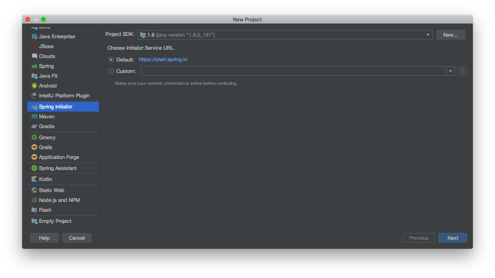
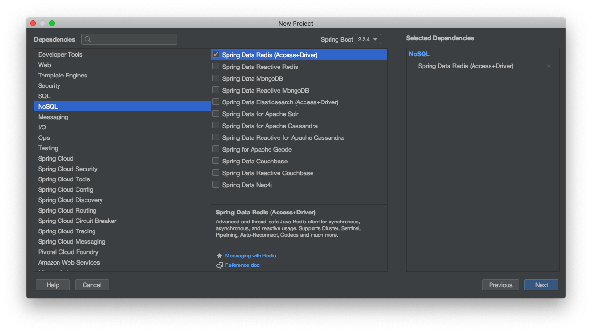

# Java客户端（下）

本章节源码：[源码]()

**Java客户端（上）**章节中我们使用了redis的Java客户端的第三方开源框架——Jedis，但目前Java应用已经被Spring（Spring Boot）统治了大半江山，就连一些数据连接操作的封装Spring也不放过，这其中也不乏有redis的封装——```Spring Data Redis```。关于```Spring Data Redis```的官方介绍：[https://spring.io/projects/spring-data-redis](https://spring.io/projects/spring-data-redis)。

使用```Spring Data Redis```后，你会发现一切变得如此简单，只需要配置文件即可做到**开箱即用**。

我们通过IDEA中的```Spring Initializer```创建Spring Boot工程，并选择```Spring Data Redis```，主要步骤入下图所示：

第一步，创建工程，选择`Spring Initializr`。



第二步，选择SpringBoot的依赖`NoSQL -> Spring Data Redis`。



创建好后，我们通过```ymal```格式的配置文件```application.yml```配置相关配置项。

```yaml
spring:
  redis:
    host: 127.0.0.1
    port: 6379
```

```Spring Data Redis```中操作redis的最关键的类是```RedisTemplate```，了解过```Spring Data```的朋友应该很熟悉```~Template```后缀，我们在配置好```application.yml```后直接写一个测试类体验一下，什么是开箱即用：

```java
package com.coderbuff.springdataredis;

import org.junit.jupiter.api.Test;
import org.springframework.beans.factory.annotation.Autowired;
import org.springframework.boot.test.context.SpringBootTest;
import org.springframework.data.redis.core.RedisTemplate;

@SpringBootTest
public class SpringDataRedisApplicationTests {

    @Autowired
    private RedisTemplate<String, String> redisTemplate;

    @Test
    void testDefaultRestTemplate() {
        redisTemplate.opsForValue().set("default_redis_template", "1");
    }
}
```

什么是开箱即用，这就是开箱即用。我们没有再写任何的类，只需要两行配置即可使用。

通常情况下，我们喜欢“封装”，喜欢把```redisTemplate.opsForValue().set```这样的操作封装成工具类```redisUtil.set```，所以我们封装一下```RedisTemplate```，顺带熟悉它的API。

```java
package com.coderbuff.springdataredis.util;

import org.springframework.beans.factory.annotation.Autowired;
import org.springframework.data.redis.core.RedisTemplate;
import org.springframework.stereotype.Component;

import java.util.concurrent.TimeUnit;

/**
 * redis操作工具类
 * @author okevin
 * @date 2020/2/18 14:34
 */
@Component
public class RedisUtil {

    @Autowired
    private RedisTemplate<Object, Object> redisTemplate;

    /**
     * 字符串类型写入操作
     * @param key key值
     * @param value value值
     */
    public void set(String key, String value) {
        this.redisTemplate.opsForValue().set(key, value);
    }

    /**
     * 可设置过期时间字符串类型写入操作
     * @param key key值
     * @param value value值
     * @param expire 过期时间
     * @param timeUnit 过期时间单位
     */
    public void set(String key, String value, Long expire, TimeUnit timeUnit) {
        this.redisTemplate.opsForValue().set(key, value, expire, timeUnit);
    }

    /**
     * 字符串类型读取操作
     * @param key key值
     * @return value值
     */
    public String get(String key) {
        return (String) this.redisTemplate.opsForValue().get(key);
    }
}
```

编写测试类：

```java
package com.coderbuff.springdataredis.util;

import org.junit.jupiter.api.Assertions;
import org.junit.jupiter.api.Test;
import org.springframework.beans.factory.annotation.Autowired;
import org.springframework.boot.test.context.SpringBootTest;

/**
 * @author okevin
 * @date 2020/2/18 23:14
 */
@SpringBootTest
public class RedisUtilTests {

    @Autowired
    private RedisUtil redisUtil;

    @Test
    public void testSet() {
        redisUtil.set("redis_util", "1");
        Assertions.assertEquals("1", redisUtil.get("redis_util"));
    }
}
```

实际上，真正要把```Spring Data Redis```用好，还可以做以下工作：

- 把redis作为Spring的缓存管理

_注意本文使用的是**SpringBoot2.x**与SpringBoot1.x有一定的区别。_

```java
package com.coderbuff.springdataredis.config;

import org.springframework.cache.annotation.CachingConfigurerSupport;
import org.springframework.cache.annotation.EnableCaching;
import org.springframework.context.annotation.Bean;
import org.springframework.context.annotation.Configuration;
import org.springframework.data.redis.cache.RedisCacheManager;
import org.springframework.data.redis.connection.RedisConfiguration;
import org.springframework.data.redis.connection.RedisConnectionFactory;
import org.springframework.data.redis.core.RedisTemplate;

/**
 * redis配置
 * @author okevin
 * @date 2020/2/18 14:20
 */
@Configuration
@EnableCaching
public class RedisConfig extends CachingConfigurerSupport {

    /**
     * 使用redis作为spring的缓存管理工具
     * 注意：springboot2.x与springboot1.x此处的区别较大
     * 在springboot1.x中，要使用redis的缓存管理工具为以下代码：
     *
     * public CacheManager cacheManager(RedisTemplate redisTemplate) {
     *     RedisCacheManager redisCacheManager = new RedisCacheManager(redisTemplate);
     *     return redisCacheManager;
     * }
     *
     * @param redisConnectionFactory redis连接工厂
     * @return redis缓存管理
     */
    @Bean
    public RedisCacheManager cacheManager(RedisConnectionFactory redisConnectionFactory) {
        RedisCacheManager redisCacheManager = RedisCacheManager.create(redisConnectionFactory);
        return redisCacheManager;
    }
}
```

- 尽管SpringBoot已经为我们构造好了```RedisTemplate```，但我们可能还是需要定制化注入```RedisTemplate```。

我们可以定制```RedisTemplate```，例如序列化的方式等，当然这些都不是必须的：

```java
package com.coderbuff.springdataredis.config;

import org.springframework.cache.annotation.CachingConfigurerSupport;
import org.springframework.cache.annotation.EnableCaching;
import org.springframework.context.annotation.Bean;
import org.springframework.context.annotation.Configuration;
import org.springframework.data.redis.cache.RedisCacheManager;
import org.springframework.data.redis.connection.RedisConnectionFactory;
import org.springframework.data.redis.core.RedisTemplate;

/**
 * redis配置
 * @author okevin
 * @date 2020/2/18 14:20
 */
@Configuration
@EnableCaching
public class RedisConfig extends CachingConfigurerSupport {

    //省略上面的cacheManager注入

    @Bean
    public RedisTemplate<Object, Object> redisTemplate(RedisConnectionFactory redisConnectionFactory) {
        RedisTemplate<Object, Object> redisTemplate = new RedisTemplate<>();
        redisTemplate.setConnectionFactory(redisConnectionFactory);     //配置连接工厂

        /*使用Jackson序列化和反序列化key、value值，默认使用JDK的序列化方式
        Jackson2JsonRedisSerializer jackson2JsonRedisSerializer = new Jackson2JsonRedisSerializer(Object.class);
        ObjectMapper om = new ObjectMapper();
        om.setVisibility(PropertyAccessor.ALL, JsonAutoDetect.Visibility.ANY);  //指定要序列化的域，ALL表示所有字段、以及set/get方法，ANY是都有包括修饰符private和public
        om.enableDefaultTyping(ObjectMapper.DefaultTyping.NON_FINAL);   //指定序列化输入的类型，NON_FINAL表示必须是非final修饰的类型
        jacksonSeial.setObjectMapper(om);

        //以下数据类型通过jackson序列化
        redisTemplate.setValueSerializer(jacksonSeial);
        redisTemplate.setKeySerializer(new StringRedisSerializer());
        redisTemplate.setHashKeySerializer(new StringRedisSerializer());
        redisTemplate.setHashValueSerializer(jacksonSeial);
        */
        redisTemplate.afterPropertiesSet();
        return redisTemplate;
    }
}
```

想要学习更多```Spring Data Redis```，就请打开官网（[https://spring.io/projects/spring-data-redis](https://spring.io/projects/spring-data-redis)）尽情探索吧。


